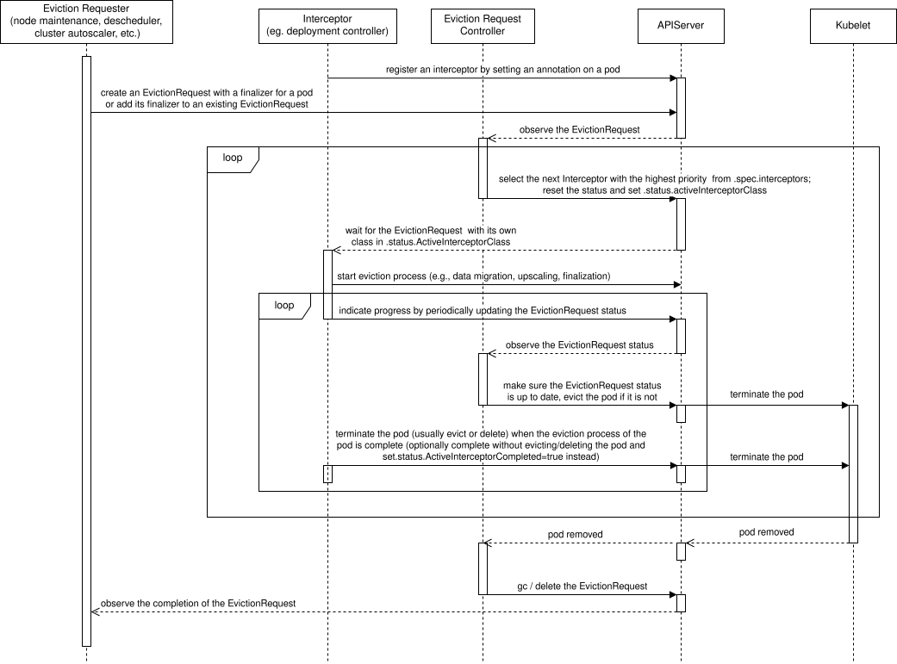

# KEP-4563: EvictionRequest API

<!-- toc -->
- [Release Signoff Checklist](#release-signoff-checklist)
- [Summary](#summary)
- [Motivation](#motivation)
  - [PodDisruptionBudget Standing Issues](#poddisruptionbudget-standing-issues)
  - [Goals](#goals)
  - [Non-Goals](#non-goals)
- [Proposal](#proposal)
  - [Eviction Requester](#eviction-requester)
  - [Pod and Interceptor](#pod-and-interceptor)
  - [Eviction Request Controller](#eviction-request-controller)
  - [User Stories (Optional)](#user-stories-optional)
    - [Story 1](#story-1)
    - [Story 2](#story-2)
    - [Story 3](#story-3)
    - [Story 4](#story-4)
    - [Story 5](#story-5)
    - [Story 6](#story-6)
  - [Notes/Constraints/Caveats (Optional)](#notesconstraintscaveats-optional)
    - [Length Limitations for Pod Annotations and EvictionRequest Finalizers](#length-limitations-for-pod-annotations-and-evictionrequest-finalizers)
  - [Risks and Mitigations](#risks-and-mitigations)
    - [Disruptive Eviction](#disruptive-eviction)
- [Design Details](#design-details)
  - [EvictionRequest](#evictionrequest)
  - [Eviction Requester](#eviction-requester-1)
    - [Eviction Requester Finalizer](#eviction-requester-finalizer)
  - [Interceptor](#interceptor)
  - [Eviction Request Controller](#eviction-request-controller-1)
    - [Interceptor Class Selection](#interceptor-class-selection)
    - [Eviction](#eviction)
    - [Garbage Collection](#garbage-collection)
  - [EvictionRequest API](#evictionrequest-api)
    - [EvictionRequest Validation and Admission](#evictionrequest-validation-and-admission)
      - [CREATE](#create)
      - [DELETE](#delete)
      - [CREATE, UPDATE, DELETE](#create-update-delete)
    - [Pod Admission](#pod-admission)
    - [Immutability of EvictionRequest Spec Fields](#immutability-of-evictionrequest-spec-fields)
  - [EvictionRequest Process](#evictionrequest-process)
  - [EvictionRequest Cancellation Examples](#evictionrequest-cancellation-examples)
    - [Multiple Dynamic Requesters and No EvictionRequest Cancellation](#multiple-dynamic-requesters-and-no-evictionrequest-cancellation)
    - [Single Dynamic Requester and EvictionRequest Cancellation](#single-dynamic-requester-and-evictionrequest-cancellation)
    - [Single Dynamic Requester and Forbidden EvictionRequest Cancellation](#single-dynamic-requester-and-forbidden-evictionrequest-cancellation)
  - [Follow-up Design Details for Kubernetes Workloads](#follow-up-design-details-for-kubernetes-workloads)
    - [ReplicaSet Controller](#replicaset-controller)
    - [Deployment Controller](#deployment-controller)
      - [Deployment Pod Surge Example](#deployment-pod-surge-example)
    - [StatefulSet Controller](#statefulset-controller)
    - [DaemonSet and Static Pods](#daemonset-and-static-pods)
    - [HorizontalPodAutoscaler](#horizontalpodautoscaler)
      - [HorizontalPodAutoscaler Pod Surge Example](#horizontalpodautoscaler-pod-surge-example)
    - [Descheduling and Downscaling](#descheduling-and-downscaling)
  - [Test Plan](#test-plan)
      - [Prerequisite testing updates](#prerequisite-testing-updates)
      - [Unit tests](#unit-tests)
      - [Integration tests](#integration-tests)
      - [e2e tests](#e2e-tests)
  - [Graduation Criteria](#graduation-criteria)
    - [Alpha](#alpha)
    - [Beta](#beta)
    - [GA](#ga)
    - [Deprecation](#deprecation)
  - [Upgrade / Downgrade Strategy](#upgrade--downgrade-strategy)
  - [Version Skew Strategy](#version-skew-strategy)
- [Production Readiness Review Questionnaire](#production-readiness-review-questionnaire)
  - [Feature Enablement and Rollback](#feature-enablement-and-rollback)
  - [Rollout, Upgrade and Rollback Planning](#rollout-upgrade-and-rollback-planning)
  - [Monitoring Requirements](#monitoring-requirements)
  - [Dependencies](#dependencies)
  - [Scalability](#scalability)
  - [Troubleshooting](#troubleshooting)
- [Implementation History](#implementation-history)
- [Drawbacks](#drawbacks)
- [Alternatives](#alternatives)
  - [EvictionRequest or Eviction subresource](#evictionrequest-or-eviction-subresource)
  - [Pod API](#pod-api)
  - [Enhancing PodDisruptionBudgets](#enhancing-poddisruptionbudgets)
  - [Cancellation of EvictionRequest](#cancellation-of-evictionrequest)
  - [The Name of the EvictionRequest Objects](#the-name-of-the-evictionrequest-objects)
    - [Pod UID](#pod-uid)
    - [Pod Name](#pod-name)
    - [Pod UID and Pod Name Prefix](#pod-uid-and-pod-name-prefix)
    - [Any Name](#any-name)
  - [Changes to the Eviction API](#changes-to-the-eviction-api)
- [Infrastructure Needed (Optional)](#infrastructure-needed-optional)
<!-- /toc -->

## Release Signoff Checklist

<!--
**ACTION REQUIRED:** In order to merge code into a release, there must be an
issue in [kubernetes/enhancements] referencing this KEP and targeting a release
milestone **before the [Enhancement Freeze](https://git.k8s.io/sig-release/releases)
of the targeted release**.

For enhancements that make changes to code or processes/procedures in core
Kubernetes—i.e., [kubernetes/kubernetes], we require the following Release
Signoff checklist to be completed.

Check these off as they are completed for the Release Team to track. These
checklist items _must_ be updated for the enhancement to be released.
-->

Items marked with (R) are required *prior to targeting to a milestone / release*.

- [x] (R) Enhancement issue in release milestone, which links to KEP dir in [kubernetes/enhancements] (not the initial KEP PR)
- [ ] (R) KEP approvers have approved the KEP status as `implementable`
- [x] (R) Design details are appropriately documented
- [x] (R) Test plan is in place, giving consideration to SIG Architecture and SIG Testing input (including test refactors)
  - [ ] e2e Tests for all Beta API Operations (endpoints)
  - [ ] (R) Ensure GA e2e tests meet requirements for [Conformance Tests](https://github.com/kubernetes/community/blob/master/contributors/devel/sig-architecture/conformance-tests.md)
  - [ ] (R) Minimum Two Week Window for GA e2e tests to prove flake free
- [x] (R) Graduation criteria is in place
  - [ ] (R) [all GA Endpoints](https://github.com/kubernetes/community/pull/1806) must be hit by [Conformance Tests](https://github.com/kubernetes/community/blob/master/contributors/devel/sig-architecture/conformance-tests.md)
- [ ] (R) Production readiness review completed
- [ ] (R) Production readiness review approved
- [x] "Implementation History" section is up-to-date for milestone
- [ ] User-facing documentation has been created in [kubernetes/website], for publication to [kubernetes.io]
- [ ] Supporting documentation—e.g., additional design documents, links to mailing list discussions/SIG meetings, relevant PRs/issues, release notes

<!--
**Note:** This checklist is iterative and should be reviewed and updated every time this enhancement is being considered for a milestone.
-->

[kubernetes.io]: https://kubernetes.io/
[kubernetes/enhancements]: https://git.k8s.io/enhancements
[kubernetes/kubernetes]: https://git.k8s.io/kubernetes
[kubernetes/website]: https://git.k8s.io/website

## Summary

There are many issues with today's Eviction API and PodDisruptionBudgets that are of great concern
to cluster administrators and application owners. These issues range from insufficient data safety,
application availability, autoscaling to node draining issues.

This KEP proposes to add a new declarative EvictionRequest API to manage the eviction of pods. Its
mission is to allow for a cooperative termination of a pod, usually in order to run the pod on
another node. If the owner of the pod does not cooperate, the eviction request will try to resort
to a pod eviction (API-initiated Eviction).

This new API can be used to implement additional capabilities around node draining, pod
descheduling, autoscaling, or as a general interface between applications and/or controllers. It
would provide additional safety and observability guarantees and prevent bad practices as opposed
to just using the current Eviction API endpoint and PodDisruptionBudgets.

## Motivation

Many of today's solutions rely on API-initiated eviction as the goto-safe way to remove
a pod from a node (kubectl drain, descheduler, cluster autoscaler, partially scheduler preemption).
Unfortunately, this is done in an application agnostic way and can cause many problems.

From an application owner or developer perspective, the only standard tool they have to protect
them against eviction is a PodDisruptionBudget. This is sufficient in a basic scenario with a simple
multi-replica application. The edge case applications, where this does not work are very important
to the cluster admin or controllers managing workload distribution on nodes, as they can for
example block the node drain. And, in turn, very important to the application owner, as the admin
can then override the pod disruption budget and disrupt their sensitive application anyway.

The major issues are:

1. Without extra manual effort, an application running with a single replica has to settle for
   experiencing application downtime during the node drain. They cannot use PDBs with
   `minAvailable: 1` or `maxUnavailable: 0`, or they will block node maintenance. Not every user
   needs high availability either, due to a preference for a simpler deployment model, lack of
   application support for HA, or to minimize compute costs. Also, any automated solution needs
   to edit the PDB to account for the additional pod that needs to be spun to move the workload
   from one node to another. This has been discussed in issue [kubernetes/kubernetes#66811](https://github.com/kubernetes/kubernetes/issues/66811)
   and in issue [kubernetes/kubernetes#114877](https://github.com/kubernetes/kubernetes/issues/114877).
2. Similar to the first point, it is difficult to use PDBs for applications that can have a variable
   number of pods; for example applications with a configured horizontal pod autoscaler (HPA). These
   applications cannot be disrupted during a low load when they have only pod. However, it is
   possible to disrupt the pods during a high load without experiencing application downtime. If
   the minimum number of pods is 1, PDBs cannot be used without blocking the node drain. This has
   been discussed in issue [kubernetes/kubernetes#93476](https://github.com/kubernetes/kubernetes/issues/93476).
3. Replicaset scaling down does not take inter-pods scheduling constraints into consideration. The
   current mechanism for choosing pods to terminate takes only [creation time,
   node rank](https://github.com/kubernetes/kubernetes/blob/cae35dba5a3060711a2a3f958537003bc74a59c0/pkg/controller/replicaset/replica_set.go#L822-L832),
   and [pod-deletion-cost annotation](https://kubernetes.io/docs/concepts/workloads/controllers/replicaset/#pod-deletion-cost)
   into account. This is not sufficient, and it can dis-balance the pods across the nodes as
   described in [kubernetes/kubernetes#124306](https://github.com/kubernetes/kubernetes/issues/124306)
   and [many other issues](https://github.com/kubernetes/kubernetes/issues/124306#issuecomment-2493091257).
4. Descheduler does not allow postponing eviction for applications that are unable to be evicted
   immediately. This can result in descheduling of incorrect set of pods. This is outlined in the
   decheduler [KEP-1397](https://github.com/kubernetes-sigs/descheduler/blob/master/keps/1397-evictions-in-background/README.md)
   and [kubernetes-sigs/descheduler#1466](https://github.com/kubernetes-sigs/descheduler/pull/1466).
5. Graceful deletion of DaemonSet pods is currently only supported as part of (Linux) graceful node
   shutdown. The length of the shutdown is again not application specific and is set cluster-wide
   (optionally by priority) by the cluster admin. This does not take into account
   `.spec.terminationGracePeriodSeconds` of each pod and may cause premature termination of
   the application. This has been discussed in issue [kubernetes/kubernetes#75482](https://github.com/kubernetes/kubernetes/issues/75482)
   and in issue [kubernetes-sigs/cluster-api#6158](https://github.com/kubernetes-sigs/cluster-api/issues/6158).
6. Different pod termination mechanisms are not synchronized with each other. So for example, the
   taint manager may prematurely terminate pods that are currently under Node Graceful Shutdown.
   This can also happen with other mechanism (e.g., different types of evictions). This has been
   discussed in the issue [kubernetes/kubernetes#124448](https://github.com/kubernetes/kubernetes/issues/124448)
   and in the issue [kubernetes/kubernetes#72129](https://github.com/kubernetes/kubernetes/issues/72129).
7. [Affinity Based Eviction](https://github.com/kubernetes/enhancements/issues/4328) is an upcoming
   feature that would like to introduce the `RequiredDuringSchedulingRequiredDuringExecution`
   nodeAffinity option to remove pods from nodes that do not match this affinity. The controller
   proposed by this feature would like to use the EvictionRequest API for the disruption safety and
   observability reasons. It can also leave the eviction logic and reconciliation to the eviction
   request controller and reducing the maintenance burden. Discussed in the KEP
   [kubernetes/enhancements#4329](https://github.com/kubernetes/enhancements/pull/4329).

This KEP is a prerequisite for the [Declarative Node Maintenance KEP](https://github.com/kubernetes/enhancements/pull/4213),
which describes other issues and consequences that would be solved by the EvictionRequest API.

Some applications solve the disruption problem by introducing validating admission webhooks.
This has some drawbacks. The webhooks are not easily discoverable by cluster admins. And they can
block evictions for other applications if they are misconfigured or misbehave. The eviction API is
not intended to be extensible in this way. The webhook approach is therefore not recommended.

Some drainers solve the node drain by depending on the kubectl logic, or by extending/rewriting it
with additional rules and logic.

As seen in the experience reports and GitHub issues ([Declarative Node Maintenance KEP](https://github.com/kubernetes/enhancements/pull/4213)),
some admins solve their problems by simply ignoring PDBs which can cause unnecessary disruptions or
data loss. Some solve this by playing with the application deployment, but have to understand that
the application supports this.


### PodDisruptionBudget Standing Issues

For completeness here is a complete list of upstream open PDB issues. Most are relevant to this KEP.

- [Mandatorliy specify how the application handle disruptions in the pod spec.](https://github.com/kubernetes/kubernetes/issues/124390)
- [Treat liveness probe-based restarts as voluntary disruptions gated by PodDisruptionBudgets](https://github.com/kubernetes/kubernetes/issues/123204)
- [Correct Keyword name for DisruptionsAllowed in PDB.](https://github.com/kubernetes/kubernetes/issues/121585)
- [maxSurge for node draining or how to meet availability requirements when draining nodes by adding pods](https://github.com/kubernetes/kubernetes/issues/114877)
- [Topology Aware Infrastructure Disruptions for Statefulsets](https://github.com/kubernetes/kubernetes/issues/114010)
- [Support PDBs for DS](https://github.com/kubernetes/kubernetes/issues/108124)
- [Allow scaling up to meet PDB constraints](https://github.com/kubernetes/kubernetes/issues/93476)
- [Priority-based preemption can easily violate PDBs even when unnecessary due to multiple issues with the implementation](https://github.com/kubernetes/kubernetes/issues/91492)
- [Disruption controller support configure workers' number](https://github.com/kubernetes/kubernetes/issues/82930)
- [Cannot drain node with pod with more than one Pod Disruption Budget](https://github.com/kubernetes/kubernetes/issues/75957)
- [Eviction should be able to request eviction asynchronously](https://github.com/kubernetes/kubernetes/issues/66811)
- [Reasonable defaults with eviction and PodDisruptionBudget](https://github.com/kubernetes/kubernetes/issues/35318)
- [New FailedEviction PodDisruptionCondition](https://github.com/kubernetes/kubernetes/issues/128815)
- [Distinguish PDB error separately in eviction API](https://github.com/kubernetes/kubernetes/issues/125500)
- [Confusing use of TooManyRequests error for eviction](https://github.com/kubernetes/kubernetes/issues/106286)

### Goals

- Introduce new EvictionRequest API (`evictionrequest.coordination.k8s.io`) and eviction request
  controller.
- Allow the EvictionRequest API to be extended with a set of interceptors for each pod.
- Use API-initiated Eviction API of pods that support the eviction request process, only if there
  are no active interceptors.

### Non-Goals

- Implement eviction request capabilities in Kubernetes workloads (ReplicaSet, Deployment, etc.).
- Implement eviction request capabilities for autoscaling, de/scheduling.
- Synchronizing of the eviction request status to the pod status.
- Introduce the eviction request concept for types other than pods.
- Synchronize all pod termination mechanisms (see #4 in the [Motivation](#motivation) section), so that they
  do not terminate pods under NodeMaintenance/EvictionRequest.

## Proposal

We will introduce a new declarative API called EvictionRequest, whose purpose is to coordinate the
eviction of a pod from a node. It creates a contract between the eviction requester, the pod, and
the interceptor (described later). The contract is enforced by the eviction request controller, the
API type and the API admission.

Pods will carry a new set of annotations about which interceptors are involved in their lifecycle.
This would allow multiple actors to take an action before the pod is terminated. Each interceptor
has a priority, and only one at a time may progress with the eviction. If there is no interceptor,
or the last interceptor (lowest priority) has finished without terminating the pod, the eviction
request controller will attempt to evict the pod using the existing API-initiated eviction.

Multiple requesters can request the eviction of the same pod, and optionally withdraw their request
in certain scenarios
([EvictionRequest Cancellation Examples](#evictionrequest-cancellation-examples)).

We can think of EvictionRequest as a managed and safer alternative to eviction.

See some practical use cases for this feature:
1. Ability to upscale first before terminating the pods with a Deployment: [Deployment Pod Surge Example](#deployment-pod-surge-example)
   based on the [EvictionRequest Process](#evictionrequest-process).
2. Ability to upscale first before terminating the pods with HPA: [HorizontalPodAutoscaler Pod Surge Example](#horizontalpodautoscaler-pod-surge-example)
   based on the [EvictionRequest Process](#evictionrequest-process).
3. Ability to select which pods to terminate when downscaling an application: [Descheduling and Downscaling](#descheduling-and-downscaling)

### Eviction Requester

The eviction requester can be any entity in the system: node maintenance controller, descheduler,
cluster autoscaler, or any application/controller interfacing with the affected application/pods.

The requester's responsibility is to communicate an intent to a pod that it should be evicted via
the EvictionRequest, according to the requester's own internal rules. It should reconcile its intent
in case the intent is removed by a third party. And it should remove its intent when the eviction
request is no longer necessary.

Example eviction request triggers:
- Node maintenance controller: node maintenance triggered by an admin.
- Descheduler: descheduling triggered by a descheduling rule.
- Cluster autoscaler: node downscaling triggered by a low node utilization.
- HPA: pod downscaling or rebalancing.

It is understood that multiple eviction requesters may request eviction of the same pod at the same
time. The requesters should coordinate their intent and not remove the eviction request until all
requesters have dropped their intent.

### Pod and Interceptor

Any pod can be the subject to an eviction request. There can be multiple interceptors for a single
pod, and they should all advertise which pods they are responsible for. Normally, the
owner/controller of the pod is the main interceptor. In a special case, the pod can be its own
interceptor. The interceptor should decide what action to take when it observes an eviction request
intent directed at that interceptor:
1. It can reject the eviction request and wait for the pod to be intercepted by another interceptor
   or evicted by the eviction request controller.
2. It can do nothing and wait for the pod to be intercepted by another interceptor or evicted by the
   eviction request controller. This is discouraged because it is slower than a simple rejection.
3. It can start the eviction logic and periodically respond to the eviction request intent to signal
   that the eviction request is in progress and not stuck. The eviction logic is at the discretion
   of the interceptor and can take many forms:
   - Migration of data (both persistent and ephemeral) from one node to another.
   - Waiting for a cleanup and release of important resources held by the pod.
   - Waiting for important computations to complete.
   - Non-graceful termination of the pod (`gracePeriodSeconds=0`).
   - Deletion of a pod that is covered by a blocking PodDisruptionBudget. The controller of the
     application should have additional logic to distinguish whether a disruption of a particular
     pod will disrupt the application as a whole.
   - After a partial cleanup (e.g. storage migrated, notification sent) and if the application is
     still in an available state, the API-initiated eviction can be used to respect
     PodDisruptionBudgets.

The end goal of an EvictionRequest is for a pod to be terminated by one of the interceptors, or by
an API-initiated eviction triggered by the eviction request controller. Usually this will also
coincide with the deletion of the pod (evict or delete call). In some scenarios, the pod may only be
terminated (e.g. by a remote call) if the pod `restartPolicy` allows it, to preserve the pod data
for further processing or debugging.

The interceptor can also choose whether it handles EvictionRequest cancellation. See
[EvictionRequest Cancellation Examples](#evictionrequest-cancellation-examples) for details.

We should discourage the creation of preventive EvictionRequests, so that they do not end up as
another PDB. So we should design the API appropriately and also not allow behaviors that do not
conform to the eviction request contract.

### Eviction Request Controller

In order to fully enforce the eviction request contract and prevent code duplication among eviction
requesters, we will introduce a new controller called the eviction request controller.

Its responsibility is to observe eviction requests from requesters and periodically check that
interceptors are making progress in evicting/terminating pods. It is important to see a consistent
effort by the interceptors to reconcile the progress of the eviction request. This is important to
prevent stuck eviction requests that could bring node maintenance to a halt. If the eviction request
controller detects that the eviction request progress updates have stopped, it will assign another
interceptor. If there is no other interceptor available, it will resort to pod eviction by calling
the eviction API (taking PodDisruptionBudgets into consideration).

It is also responsible for garbage collection/deletion of existing eviction requests whose pods have
reached terminal phase (`Succeeded` or `Failed`) or have been deleted from etcd storage.

### User Stories (Optional)

#### Story 1

As a cluster admin I want high-level components like node maintenance (planned replacement of
kubectl drain), scheduler, descheduler to use the EvictionRequest API to gracefully remove pods from
a set of nodes. I also want to see the progress of ongoing eviction requests and be able to debug
them if something goes wrong. This means to:
- Easily identify pods that have accepted eviction requests and are making progress. If possible to
  be able to see eviction request's ETA.
- Identify pods that are being evicted by the API-intiated eviction instead of being intercepted and
  to be able to distinguish pods that are failing eviction.
- See additional debug information from the active interceptor and be able to identify all the
  registered interceptors.

#### Story 2

As an application owner, I want to run single replica applications without disruptions and have the
ability to easily migrate the workload pods from one node to another. This also applies to
applications with larger number of replicas that prefer to surge (upscale) pods first instead of
downscaling.

#### Story 3

As an application owner, I want to have a custom logic tailored to my application for migration,
down-scaling, or removal of pods. I want to be able to easily override the default eviction request
process, including the eviction and PDBs, available to workloads. To achieve this, I also need to
be able to identify other actors (interceptors) and an order in which they will run.

#### Story 4

As an application owner, I want my pods to be scheduled on correct nodes. I want to use the
descheduler or the upcoming Affinity Based Eviction feature to remove pods from incorrect nodes
and then have the pods scheduled on new ones. I want to do the rescheduling gracefully and be able
to control the disruption level of my application (even 0% application unavailability).

#### Story 5

As an application owner, I run a large Deployment with pods that utilize TopologySpreadConstraints.
I want to downscale such a Deployment so that these constraints are preserved and the pods are
correctly balanced across the nodes.

#### Story 6

As an application owner, I want to trigger the termination of my pods with `restartPolicy=Never` by
means other than pod deletion. I want to keep the pod object present for tracking and debugging
purposes after it has reached the terminal phase (`Succeeded` or `Failed`).

### Notes/Constraints/Caveats (Optional)

#### Length Limitations for Pod Annotations and EvictionRequest Finalizers

We use the following finalizers in EvictionRequest objects:
`requester.evictionrequest.coordination.k8s.io/name_${EVICTION_REQUESTER_SUBDOMAIN}`.

We use the following annotations in Pod objects:
`interceptor.evictionrequest.coordination.k8s.io/priority_${INTERCEPTOR_CLASS}: ${PRIORITY}/${ROLE}`.

Key validation for both of these is subject to [IsQualifiedName](https://github.com/kubernetes/kubernetes/blob/cae35dba5a3060711a2a3f958537003bc74a59c0/staging/src/k8s.io/apimachinery/pkg/util/validation/validation.go#L42)
validation. The key consists of `prefix/name`. The maximum length of the name is 63 characters,
which may not always be enough for `EVICTION_REQUESTER_SUBDOMAIN` and `INTERCEPTOR_CLASS` (also
DNS subdomain) after adding the length of `name_` and `priority_` respectively.

If the name component of the key is greater than 63 characters, it is recommended to use a unique
shortcut of your subdomain name.
For example, `deployment.apps.k8s.io` instead of `deployment.apps.kubernetes.io`.

We do not expect a large number of requesters and interceptors. If this becomes a larger problem in
the future, we can implement an additional scheme:

```yaml
annotations:
  interceptor.evictionrequest.coordination.k8s.io/priority_${INTERCEPTOR_CLASS_HASH}: ${PRIORITY}/${ROLE}
  interceptor.evictionrequest.coordination.k8s.io/hash_${INTERCEPTOR_CLASS_HASH}: ${INTERCEPTOR_CLASS}
```

which would result in

```yaml
annotations:
  interceptor.evictionrequest.coordination.k8s.io/priority_7bb77f87dc: "11000/knowledgeable-app-specific"
  interceptor.evictionrequest.coordination.k8s.io/hash_7bb77f87dc: "sensitive-workload-operator.tom-and-jerry-delicious-fruit-company.com"
```

`7bb77f87dc` value is a hash of `sensitive-workload-operator.tom-and-jerry-delicious-fruit-company.com`

### Risks and Mitigations

If there is no interceptor, and the application has insufficient availability and a blocking PDB or
blocking validating admission webhook, then the eviction request controller will enter into an
API-initiated eviction cold loop. To mitigate this we will increment
`.status.failedAPIEvictionCounter` and `evictionrequest_controller_evictions` metric.

An interceptor could reconcile the status properly without making any progress. It is thus
recommended to check `creationTimestamp` of the EvictionRequests and observe
`evictionrequest_controller_active_interceptor` metric to see how much it takes for an interceptor
to complete the eviction. This metric can be also used to implement additional alerts.

#### Disruptive Eviction

When using kubectl drain, pods without owning controller and pods with local storage
(having `emptyDir` volumes) are not evicted by default. We have decided to evict most
of the pods (except DaemonSet and mirror pods) by default. In the motivation section of the
[Declarative Node Maintenance KEP](https://github.com/kubernetes/enhancements/pull/4213),
we can see many administrators override these default settings and many components evict all pods
indiscriminately. There are also many ways that users use to prevent the eviction;
PodDisruptionBudgets, validating admission webhooks, or just plain HA. Users who want to protect
their applications in today's clusters should already be aware that they should be able to handle
sudden evictions. Therefore, it should be okay for the eviction request controller to evict these
pods.

To mitigate the sudden eviction problem, users should use PodDisruptionBudgets or HA.

## Design Details

### EvictionRequest

We will introduce a new type called `evictionrequest.coordination.k8s.io` to enforce the contract
between the eviction requesters and the interceptors. This type is a bit similar to
`leases.coordination.k8s.io` in that it requires multiple actors to synchronize the state. Which in
our case is the progress of the eviction.

### Eviction Requester
[Eviction Requester](#eviction-requester) section provides a general overview.

There can be many eviction requesters for a single EvictionRequest.

When a requester decides that a pod needs to be evicted, it should create an EvictionRequest:
- `.metadata.name` should be set to the pod UID to avoid conflicts and allow for easier lookups
  as the name is predictable. For more details, see
  [The Name of the EvictionRequest Objects](#the-name-of-the-evictionrequest-objects) alternatives section.
- `.spec.podRef` should be set to fully identify the pod. The name and the UID should be
  specified to ensure that we do not evict a pod with the same name that appears immediately
  after the previous pod is removed.
- `.spec.progressDeadlineSeconds` should be set to a reasonable value. It is recommended to leave
  it at the default value of 1800 (30m) to allow for potential interceptor disruptions.
- `.spec.interceptors` value will be resolved on the EvictionRequest admission from the pod and
  should ideally not be set by the requester. This is done to maintain consistent
  `.spec.interceptors` field resolution across different requesters.

It should also add itself to the EvictionRequest finalizers upon creation. If the eviction request
already exists for this pod, the requester should still add itself to the finalizers. The finalizers
are used for:
- Tracking the requesters of this eviction request intent. This is used for observability and to
  handle concurrency for multiple requesters asking for the cancellation. The eviction request can
  be cancelled/deleted once all requesters have asked for the cancellation (see
  [EvictionRequest Cancellation Examples](#evictionrequest-cancellation-examples) for details).
- Processing the eviction request result by the requester once the eviction process is complete.

If the eviction is no longer needed, the requester should remove itself from the finalizers of the
EvictionRequest. The eviction request will be then deleted by the eviction request controller. In
case the interceptor has set `.status.evictionRequestCancellationPolicy` to `Forbid`, the eviction
process cannot be cancelled, and the eviction request controller will wait to delete the eviction
request until the pod is fully terminated.

#### Eviction Requester Finalizer
To distinguish between requester and other finalizers, requesters should use finalizers in the
following format: `requester.evictionrequest.coordination.k8s.io/name_${EVICTION_REQUESTER_SUBDOMAIN}`.
For example, the node maintenance eviction requester would use the
`requester.evictionrequest.coordination.k8s.io/name_nodemaintenance.k8s.io` finalizer.

Requester finalizers with `requester.evictionrequest.coordination.k8s.io/name_` prefix/qualified
name prefix are automatically removed upon pod removal by the eviction request controller. If the
requester needs to perform additional final tasks before the EvictionRequest object is removed, it
should create a second finalizer without this well-known prefix.

The eviction requester should only add and remove its own finalizer and should not touch other
finalizers with the `requester.evictionrequest.coordination.k8s.io/` or
`evictionrequest.coordination.k8s.io/` prefix.

### Interceptor

[Pod and Interceptor](#pod-and-interceptor) section provides a general overview.

There can be multiple interceptors for a single pod, which can be given control of the eviction
process by the eviction request controller.

We can distinguish 4 different kinds of interceptors:
- `partial`: it handles only a part of the eviction process (e.g. releasing one kind of resource).
  This interceptor should not terminate the pod.
- `knowledgeable`: has more knowledge (e.g. specific to the deployed application) about how to
  handle a more graceful eviction than the controller of the pod (e.g. StatefulSet, Deployment).
  This can result in the termination of the pod.
- `controller`: handles full graceful eviction in a generic way and should result in a pod
  termination. It can be preempted by a `knowledgeable` interceptor.
- `fallback`: can handle eviction if all previous interceptors have failed. This means that
  `knowledgeable` or `controller` interceptors have either reported no progress, or are simply not
  implemented for the target pod.

The interceptor should first mark the pods it is interested in evicting/intercepting (either
partially or fully) with the
`interceptor.evictionrequest.coordination.k8s.io/priority_${INTERCEPTOR_CLASS}: ${PRIORITY}/${ROLE}`
annotation. This annotation is parsed into the `Interceptor` type in the [EvictionRequest API](#evictionrequest-api).

- `INTERCEPTOR_CLASS`: should be unique interceptor's DNS subdomain, the maximum length is 54
  characters (`63 - len("priority_")`)
- `PRIORITY` and `ROLE`
  - `controller` should always set a `PRIORITY=10000` and `ROLE=controller`.
  - Other interceptors should set `PRIORITY` according to their own needs (minimum value (lowest
    priority) is 0, maximum value (highest priority) is 100000). Higher priorities are selected
    first by the eviction request controller. They can use the `controller` interceptor as a
    reference point, if they want to be run before or after the `controller` interceptor. They can
    also observe pod annotations and detect what other interceptors have been registered for the
    eviction process. `ROLE` is optional and can be used as a signal to other interceptors. The
    `controller` value is reserved for pod controllers, but otherwise there is no guidance on how
    the third party interceptors should name their role.
  - Priorities `9900-10100` are reserved for interceptors with a class that has the same parent
    domain as the controller interceptor. Duplicate priorities are not allowed in this interval.
  - The number of interceptor annotations is limited to 30 in the 9900-10100 interval and to 70
    outside of this interval.

More details about the pod and interceptor annotation admission rules can be found in
[Pod Admission](#pod-admission).

Example pod with interceptor annotations:

```yaml
apiVersion: v1
kind: Pod
metadata:
  annotations:
    interceptor.evictionrequest.coordination.k8s.io/priority_fallback-interceptor.rescue-company.com: "2000"
    interceptor.evictionrequest.coordination.k8s.io/priority_replicaset.apps.k8s.io: "10000/controller"
    interceptor.evictionrequest.coordination.k8s.io/priority_deployment.apps.k8s.io: "10001/higher-level-controller"
    interceptor.evictionrequest.coordination.k8s.io/priority_sensitive-workload-operator.fruit-company.com: "11000/knowledgeable-app-specific"
    interceptor.evictionrequest.coordination.k8s.io/priority_horizontalpodautoscaler.autoscaling.k8s.io: "12000/hpa"
  labels:
    app: nginx
  name: sensitive-app
  namespace: blueberry
```

The interceptor should observe the eviction request objects that match the pods that the interceptor
manages (e.g. through a labelSelector or ownerReferences). It should start the eviction process only
if it observes the `.status.activeInterceptorClass` in the EvictionRequest object that matches the
`INTERCEPTOR_CLASS` it previously set in the annotation.

If the interceptor is not interested in intercepting/evicting the pod anymore, it should set
`.status.activeInterceptorCompleted=true`. If the interceptor is unable to respond to the eviction
request, the `.spec.progressDeadlineSeconds` will timeout and control of the eviction process will
be passed to the next interceptor with the highest priority. If there is none, the pod will get
evicted by the eviction request controller.

If the interceptor is interested in intercepting/evicting the pod it should look at
`.spec.progressDeadlineSeconds` and make sure to update the status periodically in less than that
duration. For example, if `.spec.progressDeadlineSeconds` is set to the default value of 1800 (30m),
it may update the status every 3 minutes. The status updates should look as follows:
- Check that `.status.activeInterceptorClass` still matches the `INTERCEPTOR_CLASS` previously set
  in the annotation and that `.status.activeInterceptorCompleted` is still false. If one of these is
  not correct and the eviction process is still not complete, it should abort the eviction process
  or output an error (e.g. via an event).
- Set `.status.progressTimestamp` to the present time to signal that the eviction request is not
  stuck.
- Update the `.status.evictionRequestCancellationPolicy` field if needed. This field might have been
  set by the previous interceptor. This field should be set to `Forbid` if the current eviction
  request process of the pod cannot be stopped/cancelled. This will block any DELETE requests on the
  EvictionRequest object. If the interceptor supports eviction request cancellation, it should make
  sure that this field is set to `Allow`, and it should be aware that the EvictionRequest object can
  be deleted at any time. See
  [EvictionRequest Cancellation Examples](#evictionrequest-cancellation-examples) for details.
- Update `.status.expectedInterceptorFinishTime` if a reasonable estimation can be made of how long
  the eviction process will take for the current interceptor. This can be modified later to change
  the estimate.
- Set `.status.message` to inform about the progress of the eviction in human-readable form.
- Optionally, `.status.conditions` can be set for additional details about the eviction request.
- Optionally, an event can be emitted to inform about the start/progress of the eviction. Or lack
  thereof, if the eviction request is blocked. The interceptor should ensure that an appropriate
  number of events is emitted. `event.involvedObject` should be set to the current EvictionRequest.

The completion of the eviction request is communicated by pod termination (usually by an evict or
delete call) and reaching the terminal phase (`Succeeded` or `Failed`). It can also withdraw from
the eviction process by setting `.status.activeInterceptorCompleted=true`.

The interceptor should prefer the eviction API endpoint call for the pod deletion/termination to
respect the PDBs, unless the eviction process is incompatible with the PDBs and the application has
already been disrupted (either by the interceptor or by external forces). Or the interceptor has a
better insight into the application availability than the PDB. In these cases, it is possible to
skip the eviction call and use the delete call directly.

Also, the interceptor should not block the eviction request by updating
the`.status.progressTimestamp` when no work is being done on the eviction. This should be decided
solely by the user deploying the application and resolved by creating a PDB.

### Eviction Request Controller

[Eviction Request Controller](#eviction-request-controller) section provides a general overview.


#### Interceptor Class Selection

The interceptor classes and their priorities are parsed from the pod annotations into the
`.spec.interceptors` on [EvictionRequest Validation and Admission](#evictionrequest-validation-and-admission).

The eviction request controller reconciles EvictionRequests and picks the highest priority
interceptor from `.spec.interceptors` and sets its `interceptorClass` to the
`.status.activeInterceptorClass`. If `.status.activeInterceptorCompleted` is true and the pod exists
or `.spec.progressDeadlineSeconds` has elapsed since `.status.progressTimestamp`, then the eviction
request controller sets `status.activeInterceptorClass` to the next highest priority interceptor
from `.spec.interceptors`. During the switch to the new interceptor, the eviction request controller
will also
- Set `.status.activeInterceptorCompleted` field to false.
- Update`.status.progressTimestamp` to the present time.
- Set `.status.expectedInterceptorFinishTime` to nil.
- Set `.status.message` to indicate that the interceptors have been switched.

#### Eviction

The eviction request controller will observe EvictionRequests and evict pods that are unable to be
terminated by calling the eviction API endpoint.

Pods that are unable to be terminated:
- EvictionRequest's `.status.activeInterceptorClass` field is empty.
- EvictionRequest's `.status.activeInterceptorCompleted` field is true and there is no other
  interceptor to select.
- EvictionRequest's `.spec.progressDeadlineSeconds` has elapsed since
  `.status.progressTimestamp` or from `.metadata.creationTimestamp` if
  `.status.progressTimestamp` is nil.

API-initiated eviction of DaemonSet pods and mirror pods is not supported. However, the
EvictionRequest can still be used to terminate them by other means.

No attempt will be made to evict pods that are currently terminating.

If the pod eviction fails, e.g. due to a blocking PodDisruptionBudget, the
`.status.failedAPIEvictionCounter` is incremented and the pod is added back to the queue with
exponential backoff (maximum approx. 15 minutes). If there is a positive progress update in the
`.status.progressTimestamp` of the EvictionRequest, it will cancel the API-initated eviction.

#### Garbage Collection

See [Eviction Requester Finalizer](#eviction-requester-finalizer) for how to distinguish
between requester and other finalizers.

The controller deletes the EvictionRequest object if any of the following points is true:
1. There are no requester finalizers (requesters have canceled their intent to evict the pod)
   and `.status.evictionRequestCancellationPolicy` is set to `Allow`.
2. The referenced pod has reached the terminal phase (`Succeeded` or `Failed`), signalling a
   successful eviction.
3. The referenced pod no longer exists (has been deleted from etcd), signalling a successful
   eviction.

For convenience, we will also remove requester finalizers with
`evictionrequest.coordination.k8s.io/` prefix when the eviction request task is complete (points 2
and 3). Other finalizers will still block deletion.

For convenience, we will set `.status.evictionRequestCancellationPolicy` back to `Allow` if the
value is `Forbid` and the pod has been fully terminated.

### EvictionRequest API

```golang

// EvictionRequest defines an eviction request
type EvictionRequest struct {
	metav1.TypeMeta `json:",inline"`

	// Object's metadata.
	// .metadata.generateName is not supported.
	// .metadata.name should match the .metadata.uid of the pod being evicted.
	// The labels of the eviction request object will be merged with pod's .metadata.labels. The
	// labels of the pod have a preference.
	// More info: https://git.k8s.io/community/contributors/devel/sig-architecture/api-conventions.md#metadata
	// +optional
	metav1.ObjectMeta `json:"metadata,omitempty" protobuf:"bytes,1,opt,name=metadata"`

	// Spec defines the eviction request specification.
	// https://git.k8s.io/community/contributors/devel/sig-architecture/api-conventions.md#spec-and-status
	// +optional
	Spec EvictionRequestSpec `json:"spec,omitempty" protobuf:"bytes,2,opt,name=spec"`

	// Status represents the most recently observed status of the eviction request.
	// Populated by the current interceptor and eviction request controller.
	// More info: https://git.k8s.io/community/contributors/devel/sig-architecture/api-conventions.md#spec-and-status
	// +optional
	Status EvictionRequestStatus `json:"status,omitempty" protobuf:"bytes,3,opt,name=status"`
}

// EvictionRequestSpec is a specification of an EvictionRequest.
type EvictionRequestSpec struct {
	// PodRef references a pod that is subject to eviction/termination.
	// This field is required and immutable.
	// +optional
	PodRef *LocalPodReference `json:"podRef,omitempty" protobuf:"bytes,1,opt,name=podRef"`

	// Interceptors reference interceptors that respond to this eviction request.
	// This field does not need to be set and is resolved when the EvictionRequest object is created
	// on admission.
	// If no interceptors are specified, the pod in PodRef is evicted using the Eviction API.
	// The maximum length of the interceptors list is 100.
	// This field is immutable.
	// +optional
	// +patchMergeKey=interceptorClass
	// +patchStrategy=merge
	// +listType=map
	// +listMapKey=interceptorClass
	Interceptors []Interceptor `json:"interceptors,omitempty"  patchStrategy:"merge" patchMergeKey:"interceptorClass" protobuf:"bytes,2,rep,name=interceptors"`

	// ProgressDeadlineSeconds is a maximum amount of time an interceptor should take to report on
	// an eviction progress by updating the .status.progressTimestamp.
	// If the .status.progressTimestamp is not updated within the duration of
	// ProgressDeadlineSeconds, the eviction request is passed over to the next interceptor with the
	// highest priority. If there is none, the pod is evicted using the Eviction API.
	//
	// The minimum value is 600 (10m) and the maximum value is 21600 (6h).
	// The default value is 1800 (30m).
	// This field is required and immutable.
	ProgressDeadlineSeconds *int32 `json:"progressDeadlineSeconds" protobuf:"varint,3,opt,name=progressDeadlineSeconds"`
}

// LocalPodReference contains enough information to locate the referenced pod inside the same namespace.
type LocalPodReference struct {
	// Name of the pod.
	// This field is required.
	Name string `json:"name" protobuf:"bytes,1,opt,name=name"`
	// UID of the pod.
	// This field is required.
	UID string `json:"uid" protobuf:"bytes,2,opt,name=uid"`
}

// Interceptor information that allows you to identify the interceptor responding to this eviction
// request. Pods can be annotated with:
// interceptor.evictionrequest.coordination.k8s.io/priority_${INTERCEPTOR_CLASS}: ${PRIORITY}/${ROLE}
// interceptor.evictionrequest.coordination.k8s.io/priority_replicaset.apps.k8s.io: "10000/controller"
// annotations that can be parsed into the Interceptor struct when the EvictionRequest object is
// created on admission.
type Interceptor struct {
	// InterceptorClass must be RFC-1123 DNS subdomain identifying the interceptor (e.g.
	// foo.example.com).
	// +required
	InterceptorClass string `json:"interceptorClass" protobuf:"bytes,1,opt,name=interceptorClass"`

	// Priority for this InterceptorClass. Higher priorities are selected first by the eviction
	// request controller. The interceptor that is the managing controller should set the value of
	// this field to 10000 to allow both for preemption or fallback registration by other
	// interceptors.
	//
	// Priorities 9900-10100 are reserved for interceptors with a class that has the same parent
	// domain as the controller interceptor. Duplicate priorities are not allowed in this interval.
	//
	// The number of interceptor annotations is limited to 30 in the 9900-10100 interval and to 70
	// outside of this interval.
	// The minimum value is 0 and the maximum value is 100000.
	// +required
	Priority int32 `json:"priority" protobuf:"varint,2,opt,name=priority"`

	// Role of the interceptor. The "controller" value is reserved for the managing controller of
	// the pod. The role can send additional signal to other interceptors if they should preempt
	// this interceptor or not.
	// +optional
	Role *string `json:"role,omitempty" protobuf:"bytes,3,opt,name=role"`
}

// EvictionRequestStatus represents the last observed status of the eviction request.
type EvictionRequestStatus struct {
	// Interceptors of the ActiveInterceptorClass can adopt this eviction request by updating the
	// ProgressTimestamp or orphan/complete it by setting ActiveInterceptorCompleted to true.
	// +optional
	ActiveInterceptorClass *string `json:"activeInterceptorClass,omitempty" protobuf:"bytes,1,opt,name=activeInterceptorClass"`

	// ActiveInterceptorCompleted should be set to true when the interceptor of the
	// ActiveInterceptorClass has fully or partially completed (may result in pod termination).
	// This field can also be set to true if no interceptor is available.
	// If this field is true, there is no additional interceptor available, and the evicted pod is
	// still running, it will be evicted using the Eviction API.
	// +optional
	ActiveInterceptorCompleted bool `json:"activeInterceptorCompleted,omitempty" protobuf:"varint,2,opt,name=activeInterceptorCompleted"`

	// ExpectedInterceptorFinishTime is the time at which the eviction process step is expected to
	// end for the current interceptor and its class.
	// May be empty if no estimate can be made.
	// +optional
	ExpectedInterceptorFinishTime *metav1.Time `json:"expectedInterceptorFinishTime,omitempty" protobuf:"bytes,3,opt,name=expectedInterceptorFinishTime"`

	// ProgressTimestamp is the time at which the eviction process was reported to be in progress by
	// the interceptor.
	// Cannot be set to the future time (after taking time skew into account).
	// +optional
	ProgressTimestamp *metav1.Time `json:"progressTimestamp,omitempty" protobuf:"bytes,4,opt,name=progressTimestamp"`

	// EvictionRequestCancellationPolicy should be set to Forbid by the interceptor if it is not possible
	// to cancel (delete) the eviction request.
	// When this value is Forbid, DELETE requests of this EvictionRequest object will not be accepted
	// while the pod exists.
	// This field is not reset by the eviction request controller when selecting an interceptor.
	// Changes to this field should always be reconciled by the active interceptor.
	//
	// Valid policies are Allow and Forbid.
	// The default value is Allow.
	//
	// Allow policy allows cancellation of this eviction request.
	// The EvictionRequest can be deleted before the Pod is fully terminated.
	//
	// Forbid policy forbids cancellation of this eviction request.
	// The EvictionRequest can't be deleted until the Pod is fully terminated.
	//
	// This field is required.
	EvictionRequestCancellationPolicy EvictionRequestCancellationPolicy `json:"evictionRequestCancellationPolicy" protobuf:"varint,5,opt,name=evictionRequestCancellationPolicy"`

	// The number of unsuccessful attempts to evict the referenced pod via the API-initiated eviction,
	// e.g. due to a PodDisruptionBudget.
	// This field is required.
	FailedAPIEvictionCounter int32 `json:"failedAPIEvictionCounter" protobuf:"varint,6,opt,name=failedAPIEvictionCounter"`

	// Message is a human readable message indicating details about the eviction request.
	// This may be an empty string.
	// +required
	// +kubebuilder:validation:Required
	// +kubebuilder:validation:MaxLength=32768
	Message string `json:"message" protobuf:"bytes,7,opt,name=message"`

	// Conditions can be used by interceptors to share additional information about the eviction
	// request.
	// +optional
	// +patchMergeKey=type
	// +patchStrategy=merge
	// +listType=map
	// +listMapKey=type
	Conditions []metav1.Condition `json:"conditions,omitempty" patchStrategy:"merge" patchMergeKey:"type" protobuf:"bytes,8,rep,name=conditions"`
}

// +enum
type EvictionRequestCancellationPolicy string

const (
// Allow policy allows cancellation of this eviction request.
// The EvictionRequest can be deleted before the Pod is fully terminated.
Allow EvictionRequestCancellationPolicy = "Allow"
// Forbid policy forbids cancellation of this eviction request.
// The EvictionRequest can't be deleted until the Pod is fully terminated.
Forbid EvictionRequestCancellationPolicy = "Forbid"
)

```

#### EvictionRequest Validation and Admission

Special admission rules should be implemented as an admission plugin. An alternative would be to
use ValidatingAdmissionPolicy, but this is not possible because we need to list the pods during the
CREATE and DELETE requests and list EvictionRequests (.spec) during DELETE requests.

##### CREATE

Name of the EvictionRequest object must be unique and predictable for each pod to prevent the creation
of multiple EvictionRequests for the same pod. We do not expect the interceptors to support interaction
with multiple EvictionRequests for a pod.

`.metadata.generateName` is not supported. If it is set, the request will be rejected.

`.metadata.name` must be identical to `.spec.podRef.uid` or the request will be rejected.
The Pod matching the `.spec.podRef.name` will be obtained from the admission plugin lister. If the
`.spec.podRef.uid` does not match with the pod's UID, the request will be rejected. For more
details, see [The Name of the EvictionRequest Objects](#the-name-of-the-evictionrequest-objects) section in
the Alternatives.

`.spec.interceptors` are set according to the pod's annotations (see [Interceptor](#interceptor) and
[EvictionRequest API](#evictionrequest-api)).

The pod labels are merged with the EvictionRequest labels (pod labels have a preference) to allow
for custom label selectors when observing the eviction requests.

`.status.activeInterceptorClass` should be empty on creation as its selection should be left on the
eviction request controller. To strengthen the validation, we should check that it is possible to
set only the highest priority interceptor in the beginning. After that it is possible to set only
the next interceptor and so on. We can also condition this transition according to the other fields.
`.status.ActiveInterceptorCompleted` should be true or `.status.ProgressTimestamp` has exceeded the
deadline.

`.status.evictionRequestCancellationPolicy` should be `Allow` on creation, as its resolution should be
left to the eviction request controller.

`.status.failedAPIEvictionCounter` can be only incremented.

##### DELETE

Delete requests are forbidden for EvictionRequest objects that have the
`.status.evictionRequestCancellationPolicy` field set to `Forbid` and the pod still exists.

##### CREATE, UPDATE, DELETE

Principal making the request should be authorized for deleting pods that match the EvictionRequest's
`.spec.podRef`.

#### Pod Admission

`interceptor.evictionrequest.coordination.k8s.io/priority_${INTERCEPTOR_CLASS}: ${PRIORITY}/${ROLE}`
annotations should be checked on pod admission:
- `PRIORITY` should be an integer with a min value `0` and a max value `100000`.
- `ROLE` is optional.
- Only one annotation of this format can have a `ROLE=controller`.
- The `controller` role should have a priority of `10000`. Other role or empty role cannot have a
  value of `10000`.
- Priorities in the `9900-10100` interval should be reserved for the sibling and descendant
  domains of the controller role. This means that `INTERCEPTOR_CLASS=replicaset.apps.k8s.io` with a
  `ROLE=controller` has a parent domain `apps.k8s.io` and any domain with that parent is allowed in
  this interval. For example `deployment.apps.k8s.io` or `customfeature.replicaset.apps.k8s.io`.
  This can be used by a controller that has its logic split between multiple components
  (e.g. ReplicaSet + Deployment), and it ensures that 3rd party controllers cannot inject their
  behavior in between a single vendor's predefined steps. And if there is a need to inject behavior,
  the priority should be increased above `10100` or below `9900` for such an interceptor class. If
  `ROLE=controller` is not set, the range `9900-10100` cannot be used.
- The number of these annotations is limited to 100. 30 slots are always reserved for the
  `ROLE=controller` and other interceptors with the same parent domain (interval `9900-10100`). 70
  slots are reserved for the rest of the general interceptors outside this interval. If there is a
  need for a larger number of interceptors, the current use case should be re-evaluated. Limiting
  the number of interceptors ensures that the EvictionRequest cannot be blocked indefinitely by
  setting an abnormally large number of these annotations on a pod.
- To prevent misuse, we will maintain a list of allowed `*.k8s.io` interceptor classes. And reject
  any classes outside the main Kubernetes project on admission.
- Annotations with duplicate priorities are not allowed in the `9900-10100` interval, but are
  allowed outside of this interval.

#### Immutability of EvictionRequest Spec Fields

`.spec.podRef` does not make sense to make mutable, the EvictionRequest is always scoped to a
specific instance of a pod. If the pod is immediately recreated with the same name, but a different
UID, a new EvictionRequest object should be created

`.spec.interceptors` is only set by the Eviction Requester and during the EvictionRequest object
create admission. We do not allow subsequent changes to this field to ensure the predictability of
the eviction request process. Also, late registration of the interceptor could go unnoticed and be
preempted by the eviction request controller, resulting in the premature eviction of the pod.

`.spec.progressDeadlineSeconds` could be made mutable, but we choose not to do that to make the
integration easier on the interceptor side. That is, if the interceptor observes the deadline it can
rely on it in its eviction process. It would be much harder to ensure correct update behavior if the
deadline is mutable.

The disadvantage of the immutability is that once the EvictionRequest is created, the eviction
requester cannot change its decision. The deadline cannot be changed even when the EvictionRequest
changes its requester, e.g. from node maintenance controller to descheduler. We must either use
similar deadline values in all requester components, or be okay with different deadlines set by
other components in the same EvictionRequest instance.

It would be also possible, not to have these fields at all and just declare a global deadline that
the clients have to meet. But it would be hard to ever change these values in the future. Compared
to updating a smaller number of eviction requesters, when a better deadline value is agreed upon.
The validation also ensures that the interval of values that can be set is reasonable.

### EvictionRequest Process

The following diagrams describe what the EvictionRequest process will look like for each actor:




### EvictionRequest Cancellation Examples

Let's assume there is a single pod p-1 of application P with interceptors A and B:

```yaml
apiVersion: v1
kind: Pod
metadata:
  annotations:
    interceptor.evictionrequest.coordination.k8s.io/priority_actor-a.k8s.io: "10000/controller"
    interceptor.evictionrequest.coordination.k8s.io/priority_actor-b.k8s.io: "11000/notifier-with-delay"
  name: p-1
```

#### Multiple Dynamic Requesters and No EvictionRequest Cancellation

1. A node drain controller starts draining a node Z and makes it unschedulable.
2. The node drain controller creates an EvictionRequest for the only pod p-1 of application P to
   evict it from a node. It sets the
   `requester.evictionrequest.coordination.k8s.io/name_nodemaintenance.k8s.io` finalizer on the
   EvictionRequest.
3. The descheduling controller notices that the pod p-1 is running in the wrong zone. It wants to
   create an EvictionRequest (named after the pod's UID) for this pod, but the EvictionRequest
   already exists. It sets the
   `requester.evictionrequest.coordination.k8s.io/name_descheduling.avalanche.io` finalizer on the
   EvictionRequest.
4. The eviction request controller designates Actor B as the next interceptor by updating
   `.status.activeInterceptorClass`.
5. Actor B updates the EvictionRequest status and also sets
   `.status.evictionRequestCancellationPolicy=Allow`.
6. Actor B begins notifying users of application P that the application will experience
   a disruption and delays the disruption so that the users can finish their work.
7. The admin changes his/her mind and cancels the node drain of node Z and makes it schedulable
   again.
8. The node drain controller removes the
   `requester.evictionrequest.coordination.k8s.io/name_nodemaintenance.k8s.io` finalizer from the
   EvictionRequest.
9. The eviction request controller notices the change in finalizers, but there is still a
   descheduling finalizer, so no action is required.
10. Actor B sets `ActiveInterceptorCompleted=true` on the eviction requests of pod p-1, which is
    ready to be deleted.
11. The eviction request controller designates Actor A as the next interceptor by updating
    `.status.activeInterceptorClass`.
12. Actor A updates the EvictionRequest status and ensures that
   `.status.evictionRequestCancellationPolicy=Allow`
13. Actor A deletes the p-1 pod.
14. EvictionRequest is garbage collected once the pods terminate even with the descheduling
    finalizer present.

#### Single Dynamic Requester and EvictionRequest Cancellation

1. A node drain controller starts draining a node Z and makes it unschedulable.
2. The node drain controller creates an EvictionRequest for the only pod p-1 of application P to
   evict it from a node. It sets the
   `requester.evictionrequest.coordination.k8s.io/name_nodemaintenance.k8s.io` finalizer on the
   EvictionRequest.
3. The eviction request controller designates Actor B as the next interceptor by updating
   `.status.activeInterceptorClass`.
4. Actor B updates the EvictionRequest status and also sets
   `.status.evictionRequestCancellationPolicy=Allow`.
5. Actor B begins notifying users of application P that the application will experience
   a disruption and delays the disruption so that the users can finish their work.
6. The admin changes his/her mind and cancels the node drain of node Z and makes it schedulable
   again.
7. The node drain controller removes the
   `requester.evictionrequest.coordination.k8s.io/name_nodemaintenance.k8s.io` finalizer from the
   EvictionRequest.
8. The eviction request controller notices the change in finalizers, and deletes (GC) the
   EvictionRequest as there is no requester present.
9. Actor B can detect the removal of the EvictionRequest object and notify users of application P
    that the disruption has been cancelled. If it misses the deletion event, then no notification
    will be delivered. To avoid this, Actor B had the option of also setting a finalizer on the
    EvictionRequest.

#### Single Dynamic Requester and Forbidden EvictionRequest Cancellation

1. A node drain controller starts draining a node Z and makes it unschedulable.
2. The node drain controller creates an EvictionRequest for the only pod p-1 of application P to
   evict it from a node. It sets the
   `requester.evictionrequest.coordination.k8s.io/name_nodemaintenance.k8s.io` finalizer on the
   EvictionRequest.
3. The eviction request controller designates Actor B as the next interceptor by updating
   `.status.activeInterceptorClass`.
4. Actor B updates the EvictionRequest status and also sets
   `.status.evictionRequestCancellationPolicy=Forbid` to prevent the EvictionRequest from deletion
   (enforced by API Admission).
5. Actor B begins notifying users of application P that the application will experience
   a disruption and delays the disruption so that the users can finish their work.
6. The admin changes his/her mind and cancels the node drain of node Z and makes it schedulable
   again.
7. The node drain controller removes the
   `requester.evictionrequest.coordination.k8s.io/name_nodemaintenance.k8s.io` finalizer from the
   EvictionRequest.
8. The eviction request controller notices the change in finalizers. Normally it should delete (GC)
   the EvictionRequest as there is no requester present, but
   `.status.evictionRequestCancellationPolicy=Forbid` prevents this.
9. Actor B sets `ActiveInterceptorCompleted=true` on the eviction requests of pod p-1, which is
    ready to be deleted.
10. The eviction request controller designates Actor A as the next interceptor by updating
    `.status.activeInterceptorClass`.
11. Actor A updates the EvictionRequest status and ensures that
    `.status.evictionRequestCancellationPolicy=Forbid`. Alternatively, it could also change it to
    `Allow` at this point, if it was just there, to ensure that Actor B's logic is atomic
12. Actor A deletes the p-1 pod.
13. EvictionRequest is garbage collected once the pods terminate. It has to first set
    `.status.evictionRequestCancellationPolicy=Allow` to allow the object to be deleted.

### Follow-up Design Details for Kubernetes Workloads

Kubernetes Workloads should be made aware of the EvictionRequest API to properly support the
eviction request process.

- ReplicaSet and ReplicationController partial support is considered. The full eviction logic should
  be implemented by a higher level workload such as Deployments. ReplicaSets are intended to be a
  simple primitive without any sophisticated scaling logic.
- Deployment support is considered.
- StatefulSet support is considered.
- DaemonSet support is considered, but will be explored as a part of the
  [Declarative Node Maintenance KEP](https://github.com/kubernetes/enhancements/pull/4213), as its
  pods should not be disrupted/evicted during normal operation.
- Jobs/CronJobs are not yet considered, because jobs should not normally run critical workloads
  that require eviction request and should therefore leave the node quickly and not block its drain.
  If required, custom interceptors can be implemented to support custom eviction logic for
  specialized types of jobs.

#### ReplicaSet Controller

Active response to EvictionRequest objects cannot be implemented without first analysing the owner
of a pod and its capabilities. For example, not all deployment strategy configurations can simply
utilize EvictionRequests without a loss of availability. This is also true for other owners.
Therefore, it does not make sense to impose such a responsibility on the replication controller
(e.g., by introducing new fields). Instead, deployments and other controllers should advertise the
interceptor capabilities on ReplicaSet pods via the interceptor annotation and implement/perform the
eviction logic.

To facilitate the eviction request of high-level workloads and to take advantage of the
EvictionRequest feature passively, the replicaset controller can prefer the deletion of pods with
corresponding EvictionRequest objects during a ReplicaSet scale down.

To correctly orchestrate these steps, replica set controller should set an interceptor
annotation on its pods:
`interceptor.evictionrequest.coordination.k8s.io/priority_deployment.apps.k8s.io: "10000/controller"`.
And not delete these pods until it becomes the active interceptor.

#### Deployment Controller

The deployment controller must first decide whether a particular Deployment supports eviction
requests according to the deployment strategy.
- `Recreate` strategy deletes all the pods at once during rollouts, and supporting the eviction
  request provides no benefit over simple eviction.
- `Rolling` update strategy with `MaxSurge` should always support eviction requests.
- `Rolling` update strategy with `MaxUnavailable` eviction request support can have certain
  advantages and disadvantages. It can reduce the pod disruption when the number of evicted pods is
  greater than the `MaxUnavailable` field. Unfortunately, in some cases the pods may be covered by
  PDBs and the pod disruptions may exceed the expected number. Therefore, we would need to introduce
  a new field (e.g. `.spec.evictionRequestStrategy`) that would provide the ability to opt into this
  behavior.

If the controller evaluates that there is a support for the EvictionRequest it should make sure that
its pods are annotated with
`interceptor.evictionrequest.coordination.k8s.io/priority_deployment.apps.k8s.io: "10001/deployment-controller"`.
We can assume that these pods are also annotated with a replica set interceptor set to
`"10000/controller"`

The controller should observe the EvictionRequest objects that correspond to the pods that the
controller manages. It should start the eviction logic when it observes that the
`.status.activeInterceptorClass` field of the EvictionRequest is equal to `deployment.apps.k8s.io`.

It should check to see that the Deployment object still supports eviction request, and if not, it
should set `.status.activeInterceptorCompleted=true`.

The implementation should then proceed by periodically updating all assigned EvictionRequest object
with progress, as described in the [Interceptor](#interceptor) section.

The eviction logic is strategy specific.

If the Deployment has a `.spec.strategy.rollingUpdate.maxSurge` value, the controller will create
surge pods by scaling up the ReplicaSet(s). If the node is under the maintenance, the new pods will
not be scheduled on that node because the `.spec.unschedulable` node field would be set to true. As
soon as the surge pods become available, the deployment controller will scale down the
ReplicaSet(s). The replica set controller will then in turn delete the pods with matching
EvictionRequest objects.

If the eviction request ends and is prematurely deleted before the surge process has a chance to
complete, the deployment controller will scale down the ReplicaSet which will then remove the extra
pods that were created during the surge.

Regardless of the Deployment strategy, if the Deployment is scaled down during an eviction request,
the ReplicaSet is scaled down and the pods with matching EvictionRequests can be terminated
immediately by the replicaset controller.

For observability, we could add the `.status.ReplicasToEvict` field to Deployments to signal how
many replicas are in a need of eviction. If this field has a positive value, it could also indicate
that an interceptor other than the deployment controller has taken the responsibility for the
eviction request and there is no work for the deployment controller to do. It could also mean that
pods are being evicted by the eviction request controller if the deployment controller has not
responded. We could also add a new condition called `EvictionRequestInProgress` that would become
`True` if there is at least one pod that is being evicted by the deployment controller or by another
interceptor. If there is no interceptor and the pods are being evicted, the value of the condition
should be `False`.

##### Deployment Pod Surge Example

We can use a Deployment with positive `.spec.strategy.rollingUpdate.maxSurge` field to prevent any
disruption for the underlying application. By scaling up first before terminating the pods.

1. A set of pods A of an application P are created with a Deployment controller interceptor
   annotation (priority 10001) and a ReplicaSet controller interceptor annotation (priority 10000).
   Application P is a PostgresSQL instance that can have 1-n pods and requires no loss of
   availability.
2. A node drain controller starts draining a node Z and makes it unschedulable.
3. The node drain controller creates an EvictionRequests for a subset B of pods A to evict them from
   a node.
4. The eviction request controller designates the deployment controller as the interceptor based on
   the highest priority by updating `.status.activeInterceptorClass`. No action (termination) is
   taken on the pods yet.
5. The deployment controller creates a set of surge pods C to compensate for the future loss of
   availability of pods B. The new pods are created by temporarily surging the `.spec.replicas`
   count of the underlying replica sets up to the value of deployments `maxSurge`.
6. Pods C are scheduled on a new schedulable node that is not under the node drain.
7. Pods C become available.
8. The deployment controller scales down the surging replica sets back to their original value.
9. The deployment controller sets `ActiveInterceptorCompleted=true` on the eviction requests of
   pods B that are ready to be deleted.
10. The eviction request controller designates the replica set controller as the next interceptor by
    updating `.status.activeInterceptorClass`.
11. The replica set controller deletes the pods to which an EvictionRequest object has been
    assigned, preserving the availability of the application.

#### StatefulSet Controller

The statefulset controller must first decide whether a particular StatefulSet supports the eviction
request according to the stateful set update strategy.
- `OnDelete` strategy is a legacy behavior that does not delete pods and waits for a manual
  deletion. We cannot provide an eviction strategy for these.
- `RollingUpdate` update strategy with `MaxUnavailable` eviction request support can have certain
  advantages and disadvantages. It can reduce the pod disruption if the number of evicted pods
  is greater than the `MaxUnavailable` field. Unfortunately, in some cases the stateful set pods
  may be covered by PDBs, and the pod disruptions might exceed the expected maximum number of
  disruptions. Therefore, we would need to introduce a new field
  (e.g., `.spec.evictionRequestStrategy`) that would provide the ability to opt into this behavior.

The eviction logic is similar to that of the [Deployment Controller](#deployment-controller). Except
that it is conditioned by the presence of the `.spec.updateStrategy.rollingUpdate.MaxUnavailable`
field and the `.spec.evictionRequestStrategy` field. Instead of the pod surge, we will delete pods
from the highest index to the lowest according to the `MaxUnavailable` field. Then we wait for the
new pods to become available, before deleting the next batch of pods until there is no
EvictionRequest object.

One alternative is to implement the `MaxSurge` feature for StatefulSets. For example a surge number
of high index pods and PVCs could be provisioned until the lower index pods can be recreated. Once
the lower index pods are migrated, the higher index pods could be scaled down and removed.

Another alternative is for the application to implement its own interceptor and register it as a
high-priority interceptor on the application pods. It can then intercept the EvictionRequest objects
and ensure graceful pod removal without any application disruption.

#### DaemonSet and Static Pods

DaemonSet pods and mirror/static pods can potentially be terminated by EvictionRequest, but cannot
be simply evicted because they can run critical services.
- The daemonset controller can be made EvictionRequest aware and graceful terminate pods on nodes
  under NodeMaintenance (proposed feature in [Declarative Node Maintenance KEP](https://github.com/kubernetes/enhancements/pull/4213)). The
  NodeMaintenance would be used by the daemonset controller as a scheduling hint to not restart the
  pods on a node.
- An application with access to a node's filesystem could observe the EvictionRequest of a mirror
  pod and remove the static pod manifest from the node, resulting in static pod termination.
- Kubelet could be made aware of the static pods EvictionRequests and allow their termination in
  certain scenarios (e.g., during the final phase of node maintenance).

#### HorizontalPodAutoscaler

A new feature could be added to HPA, to temporarily increase the amount of pods during a disruption.

Upon detecting an eviction request of pods under the HPA workload, the HPA would increase the number
of replicas by the number of eviction requests. It would become an interceptor and reconcile the
EvictionRequest status until these new pods become ready. Then it would set
`.status.activeInterceptorCompleted` to `true` to allow the eviction request controller to evict
these pods. After the evicted pods terminate and the EvictionRequest objects are garbage collected,
HPA can decrease the number of pods required by the workload to the original number.

This has the following benefits:
- 1 replica applications can run on the cluster without losing any availability during a disruption.
  This allows running applications in scenarios where HA is not possible or necessary.
- No PDB is required anymore to ensure a minimum availability. No 3rd part PDB spec reconciliation
  is necessary. HPA applications will never lose any availability due to EvictionRequests. The
  availability can still be lost by other means. We expect that all components will eventually move
  to the EvictionRequest API instead of using a raw eviction API.

HPA could get into the conflict with the pod controller (e.g. Deployment). Different controllers
have different scaling approaches to HPA. This could be resolved with an opt-in behavior, by setting
the interceptor priority to each HPA object.The HPA controller would then annotate the workload pods
with its interceptor class and a priority.

- By default, we could set a lower priority than controllers, which have a default priority of
  `10000`. We would prefer the controller's behaviour. For example, Deployment's `.spec.maxSurge`
  would be preferred over HPA. Otherwise, HPA might scale less or more than `.spec.maxSurge`.
- If the HPA scaling logic is preferred, a user could set a higher priority on the HPA object.


##### HorizontalPodAutoscaler Pod Surge Example

We can use HPA running 1 pod to prevent a disruption for the underlying application. By scaling up
first before terminating the pods.

1. A single pod A of application W is created with a ReplicaSet controller interceptor annotation
   (priority 10000). Application W is a webserver that is scaled dynamically according to the
   traffic. If there is a low traffic, HPA scales down the number of pods to 1. The application
   should not lose availability when its single replica gets disrupted.
2. The Deployment and its pods are controlled/scaled by the HPA. The HPA sets an interceptor
   annotation (higher priority, e.g. 11000) on all of these pods.
3. A node drain controller starts draining a node Z and makes it unschedulable.
4. The node drain controller creates an EvictionRequest for the only pod of application W to evict
   it from a node.
5. The eviction request controller designates the HPA as the interceptor based on the highest
   priority by updating `.status.activeInterceptorClass`. No action (termination) is taken on the
   single pod yet.
6. The HPA controller creates a single surge pod B to compensate for the future loss of
   availability of pod A. The new pod is created by temporarily scaling up the deployment.
7. Pod B is scheduled on a new schedulable node that is not under the node drain.
8. Pod B becomes available.
9. The HPA scales the surging deployment back down to 1 replica.
10. The HPA sets `ActiveInterceptorCompleted=true` on the eviction requests of pod A, which is ready
    to be deleted.
11. The eviction request controller designates the replica set controller as the next interceptor by
    updating `.status.activeInterceptorClass`.
12. The replica set controller deletes the pods to which an EvictionRequest object has been
    assigned, preserving the availability of the webserver.


#### Descheduling and Downscaling

We can use the EvictionRequest API to deschedule a set of pods controlled by a
Deployment/ReplicaSet. This is useful when we want to remove a set of pods from a node, either for
node maintenance reasons or to rebalance the pods across additional nodes.

If set up correctly, the deployment controller will first scale up its pods to achieve this. In
order to support any de/scheduling constraints during downscaling, we should temporarily disable an
immediate upscaling.

HPA Downscaling example:

1. Pods of application A are created with a Deployment controller interceptor annotation
   (priority 10001) and a ReplicaSet controller interceptor annotation (priority 10000).
2. The Deployment and its pods are controlled/scaled by the HPA. The HPA sets an interceptor
   annotation (higher priority, e.g. 11000) on all of these pods.
3. A subset of pods from application A are chosen by the HPA to be scaled down. This may be done in
   a collaboration with another component responsible for resolving the scheduling constraints.
4. The HPA creates EvictionRequest objects for these chosen pods.
5. The eviction request controller designates the HPA as the interceptor based on the highest
   priority. No action (termination) is taken on the pods yet.
6. The HPA downscales the Deployment workload.
7. The HPA sets `ActiveInterceptorCompleted=true` on its own eviction requests.
8. The eviction request controller designates the deployment controller as the next interceptor by
   updating `.status.activeInterceptorClass`.
9. The deployment controller subsequently scales down the underlying ReplicaSet(s).
10. The deployment controller sets `ActiveInterceptorCompleted=true` on the eviction requests of
    pods that are ready to be deleted.
11. The eviction request controller designates the replica set controller as the next interceptor by
    updating `.status.activeInterceptorClass`.
12. The replica set controller deletes the pods to which an EvictionRequest object has been
    assigned, preserving the scheduling constraints.

The same can be done by any descheduling controller (instead of an HPA) to re-balance a set of Pods
to comply with de/scheduling rules.

### Test Plan

[x] I/we understand the owners of the involved components may require updates to
existing tests to make this code solid enough prior to committing the changes necessary
to implement this enhancement.

##### Prerequisite testing updates

N/A

##### Unit tests

- `pkg/apis/core/validation`: `2024-06-03` - `84.1%`

##### Integration tests

<!--
Integration tests are contained in k8s.io/kubernetes/test/integration.
Integration tests allow control of the configuration parameters used to start the binaries under test.
This is different from e2e tests which do not allow configuration of parameters.
Doing this allows testing non-default options and multiple different and potentially conflicting command line options.
-->

<!--
This question should be filled when targeting a release.
For Alpha, describe what tests will be added to ensure proper quality of the enhancement.

For Beta and GA, add links to added tests together with links to k8s-triage for those tests:
https://storage.googleapis.com/k8s-triage/index.html

- <test>: <link to test coverage>
-->

- Switching on and off the gate should enable/disable the feature and increase pod validation.
- Test all the interactions between the eviction request controller and the interceptor.
- Test that the eviction of the pod happens if there is no interceptor or the interceptor stops
  responding.
- Test switching between different interceptors/classes and resetting the EvictionRequest status.
- Test the EvictionRequest object garbage collection and requester finalizers.

##### e2e tests

<!--
This question should be filled when targeting a release.
For Alpha, describe what tests will be added to ensure proper quality of the enhancement.

For Beta and GA, add links to added tests together with links to k8s-triage for those tests:
https://storage.googleapis.com/k8s-triage/index.html

We expect no non-infra related flakes in the last month as a GA graduation criteria.

- <test>: <link to test coverage>
-->

- Test the full eviction request flow with multiple interceptors.
- Test the eviction backoff if the API-initiated eviction is blocked by a PDB. Check that the
  eviction terminates the pod once PDB stops blocking the disruption

### Graduation Criteria

#### Alpha

- Feature implemented behind a feature flag.
- Unit, integration and e2e tests implemented and passing.

#### Beta

- Feature gate enabled by default.
- Unit, integration and e2e tests passing.
- Manual test for upgrade->downgrade->upgrade path will be performed.
- Asses the state of the [NodeMaintenance feature](https://github.com/kubernetes/enhancements/issues/4212)
  and other components interested in using the EvictionRequest API.
- Re-evaluate whether adding additional metrics and events would be helpful. And update the KEP
  with existing ones.
- Consider adding information to a pod to indicate that it is being evicted by EvictionRequest. For
  example via a condition.

#### GA

- Every bug report is fixed.
- E2E tests should be graduated to conformance.
- Re-evaluate whether adding additional metrics would be helpful.
- At least one Kubernetes workload (e.g., Deployment) should support eviction request to fully test
  the new API and flow.
- Adoption: look at all the consumers of the API, especially the requesters and interceptors. Look
  at how the API is being used and see if there are any pain points that we could address.
- Evaluate whether we can make changes to the eviction API to increase the safety for applications
  and help with EvictionRequest API adoption. See [Changes to the Eviction API](#changes-to-the-eviction-api)
  for more details.

#### Deprecation

- Remove the feature-gate in GA+2.

### Upgrade / Downgrade Strategy

The feature is gated and no changes are required for an existing cluster to use the enhancement.

### Version Skew Strategy

A version skew between the kube-controller-manager and the kube-apiserver is not supported as the
feature will not work properly. The feature should be used after a full upgrade has completed.

If kube-apiserver is behind, the EvictionRequest API will not be served.

If kube-controller is behind, the eviction request controller will not run and reconcile the
EvictionRequests. Thus, there will be no selection of interceptors, eviction of pods, or garbage
collection.

## Production Readiness Review Questionnaire

### Feature Enablement and Rollback

###### How can this feature be enabled / disabled in a live cluster?

- [x] Feature gate (also fill in values in `kep.yaml`)
  - Feature gate name: EvictionRequestAPI
  - Components depending on the feature gate: kube-apiserver, kube-controller-manager

###### Does enabling the feature change any default behavior?

Pod annotations with `interceptor.evictionrequest.coordination.k8s.io/priority_` prefix will be
validated. Since this is an unused k8s domain prefix, it should not cause any harm.

###### Can the feature be disabled once it has been enabled (i.e. can we roll back the enablement)?

Yes it can be rolled backed by disabling the feature gate, but it will cancel any pending eviction
requests. This means that pods that have been requested to be evicted, will continue to run. Also,
any component that depends on the EvictionRequest API (e.g. eviction requester, interceptor) will
also stop working or will not operate correctly.

It is not advisable to disable this feature, as it may leave the pods in the cluster in an undefined
state. This may be especially harmful for applications that are in the middle of data migration.

Cluster admin should take the following precautions, before disabling this feature.
- Ensure that no eviction requests are in progress and no new eviction requests will occur during
  the disablement.
- Ensure that all dependent components (eviction requesters, interceptors) in the cluster support
  disabling the feature.

###### What happens if we reenable the feature if it was previously rolled back?

The eviction request controller will start working again. And the pending eviction requests will
begin to migrate or evict pods from nodes.

###### Are there any tests for feature enablement/disablement?

<!--
The e2e framework does not currently support enabling or disabling feature
gates. However, unit tests in each component dealing with managing data, created
with and without the feature, are necessary. At the very least, think about
conversion tests if API types are being modified.

Additionally, for features that are introducing a new API field, unit tests that
are exercising the `switch` of feature gate itself (what happens if I disable a
feature gate after having objects written with the new field) are also critical.
You can take a look at one potential example of such test in:
https://github.com/kubernetes/kubernetes/pull/97058/files#diff-7826f7adbc1996a05ab52e3f5f02429e94b68ce6bce0dc534d1be636154fded3R246-R282
-->

The tests will be added in alpha.

### Rollout, Upgrade and Rollback Planning

###### How can a rollout or rollback fail? Can it impact already running workloads?

During a rollout a bug could occur, resulting in a high load on the apiserver. Also, it is not
recommended to use the EvictionRequest API during a rollout, as mentioned in the
[Version Skew Strategy](#version-skew-strategy)

As mentioned in [Feature Enablement and Rollback](#feature-enablement-and-rollback), it is not
recommended to disable this feature. Cluster admin should take special precautions before disabling
the feature.

###### What specific metrics should inform a rollback?

- If there is an unreasonably large number of evictions reported by a
  `evictionrequest_controller_evictions` metric.
- Large values of the `workqueue_depth` and `workqueue_work_duration_seconds` metrics may indicate
  a problem.

###### Were upgrade and rollback tested? Was the upgrade->downgrade->upgrade path tested?

A manual test will be performed, as follows:

1. Create a cluster in 1.30.
2. Upgrade to 1.31.
3. Create an EvictionRequest A and pod A. Observe that the EvictionRequest evicts the pod and
   terminates it. Observe that the EvictionRequest gets garbage collected at the end.
4. Create an EvictionRequest B, pod B and PDB B targeting the pod B with `maxUnavailable=0`. Observe
   that the EvictionRequest increases the `.status.failedAPIEvictionCounter`, but does not evict the
   pod.
5. Downgrade to 1.30.
6. Delete PDB B. Observe that the pod B keeps running without any termination.
7. Upgrade to 1.31.
8. Observe that the EvictionRequest B evicts pod B and terminates it. Observe that the
   EvictionRequest B gets garbage collected at the end.

###### Is the rollout accompanied by any deprecations and/or removals of features, APIs, fields of API types, flags, etc.?

No.

### Monitoring Requirements

###### How can an operator determine if the feature is in use by workloads?

By observing the `evictionrequest_controller_evictions`, `evictionrequest_controller_active_interceptor`,
`evictionrequest_controller_pod_interceptors` and `workqueue` metrics.

Cluster state can also be checked:
- It is possible to create EvictionRequest objects.
- EvictionRequest status is reconciled and a pod referenced in the EvictionRequest is eventually
  terminated.

###### How can someone using this feature know that it is working for their instance?

- [x] Events
  - Event Reason: TBD (will be added in Beta)
- [x] EvictionRequest API .status
  - Other field: all the status fields are correctly reconciled
- [x] Other (treat as last resort)
  - Details: After creating the EvictionRequest, the referenced pods should eventually be terminated.

###### What are the reasonable SLOs (Service Level Objectives) for the enhancement?

No new SLOs are added.

This feature should comply with the existing SLO about processing mutating API calls.

###### What are the SLIs (Service Level Indicators) an operator can use to determine the health of the service?

- [x] Metrics
  - Metric name: `evictionrequest_controller_evictions` (number of evictions per EvictionRequest and Pod)
    - Components exposing the metric: kube-controller-manager (new)
  - Metric name: `evictionrequest_controller_active_interceptor` (active interceptor per EvictionRequest and Pod)
    - Components exposing the metric: kube-controller-manager (new)
  - Metric name: `evictionrequest_controller_active_requester` (active interceptor per EvictionRequest and Pod)
      - Components exposing the metric: kube-controller-manager (new)
  - Metric name: `evictionrequest_controller_pod_interceptors` (available interceptors per Pod)
      - Components exposing the metric: kube-controller-manager (new)
  - Metric name: `workqueue_depth`, `workqueue_adds_total`, `workqueue_queue_duration_seconds`, `workqueue_work_duration_seconds`, `workqueue_unfinished_work_seconds`, `workqueue_retries_total`
    - [Optional] Aggregation method: name=evictionrequests
    - Components exposing the metric: kube-controller-manager (new)

###### Are there any missing metrics that would be useful to have to improve observability of this feature?

We will reevaluate whether adding additional metrics would be helpful at Beta and GA graduation.

### Dependencies

###### Does this feature depend on any specific services running in the cluster?

No.

### Scalability

###### Will enabling / using this feature result in any new API calls?

New API calls by the kube-controller-manager:
- List and watch for EvictionRequests.
- Update calls to reconcile EvictionRequest status. This is also done by an active 3rd party
  interceptor.
- At least one `/eviction` call for each EvictionRequest. And possibly more with a backoff. This
  should not dramatically increase the apiserver usage, as these calls should be made in similar
  situations as today. Instead of repeating the eviction API call manually with a components/cli
  (e.g. kubectl drain), it will be done by a controller.


###### Will enabling / using this feature result in introducing new API types?

- API type: EvictionRequest
- Supported number of objects per cluster: 150000 (same as pods)
- Supported number of objects per namespace 3000 (same as pods)

###### Will enabling / using this feature result in any new calls to the cloud provider?

No.

###### Will enabling / using this feature result in increasing size or count of the existing API objects?

No.

###### Will enabling / using this feature result in increasing time taken by any operations covered by existing SLIs/SLOs?

No.

We will add an admission plugin, but it should not significantly increase the time for operations.

###### Will enabling / using this feature result in non-negligible increase of resource usage (CPU, RAM, disk, IO, ...) in any components?

Small RAM increase in kube-apiserver and kube-controller-manager to accommodate for caching the new
API EvictionRequest type.

Small CPU increase in kube-controller-manager to run additional controller.

###### Can enabling / using this feature result in resource exhaustion of some node resources (PIDs, sockets, inodes, etc.)?

No.

### Troubleshooting

###### How does this feature react if the API server and/or etcd is unavailable?

- It is not possible to communicate eviction intent via the EvictionRequest API.
- EvictionRequest pods are not evicted/terminated.
- Migration operations done by interceptors may still happen in the background, but the
  observability will be limited.

###### What are other known failure modes?

N/A

###### What steps should be taken if SLOs are not being met to determine the problem?

Apart from checking the metrics, events and EvictionRequest API status, kube-controller-manager and
kube-apiserver logs should be checked.

If the apiserver is flooded with requests (eviction, etc.), the feature gate should be turned off.
Before the feature gate is turned off, special precautions should be taken as mentioned in
[Feature Enablement and Rollback](#feature-enablement-and-rollback).

## Implementation History

- 2023-03-28: Evacuation API KEP was spun off from [Declarative NodeMaintenance](https://github.com/kubernetes/enhancements/issues/4212) KEP.
- 2024-12-03: Evacuation API was renamed to EvictionRequest API.

## Drawbacks

## Alternatives

### EvictionRequest or Eviction subresource

Creating a pod subresource similar to the eviction one for the eviction request, or modifying the
eviction subresource is not really feasible because we need to persist the eviction request
information. EvictionRequests can take a long time, and we cannot block a single request until it is
done or allow polling.

There are multiple entities (Eviction Requesters, Interceptors, eviction request controller) that
need to communicate their intent to evict a pod, report on the progress of the eviction, manage the
lifecycle of the eviction request, and to handle the change of ownership between requesters and
between interceptors. This is better done through a standalone API resource object.

### Pod API

The original proposal in the [Declarative Node Maintenance KEP](https://github.com/kubernetes/enhancements/pull/4213)
was to use pod conditions to communicate the intent of EvictionRequest between the eviction
requester and the interceptor.

Two new condition types would be introduced:
1. `EvacuationRequested` condition should be set by a controller (e.g. node maintenance controller)
   on the pod to signal a request to evacuate the pod from the node. A reason should be given to
   identify the requester, in our case `EvacuationByNodeMaintenance` (similar to how `DisruptionTarget`
   condition behaves). The requester has the ability to withdraw the request by removing the
   condition or setting the condition status to `False`. Other controllers can also use this
   condition to request evacuation. For example, a descheduler could set this condition to `True`
   and give a `EvacuationByDescheduler` reason. Such a controller should not overwrite an  existing
   request and should wait for either the pod deletion or removal of the evacuation request. The
   owning controller of the pod should observe the pod's conditions and respond to the
   `EvacuationRequested` by accepting it and setting an `EvacuationInitiated` condition to `True` in
   the pod conditions.
2. `EvacuationInitiated` condition should be set by the owning controller to signal that work is
   being done to either remove or evacuate/migrate the pod to another node. The draining
   process/controller should wait a reasonable amount of time (3 minutes) to observe the appearance
   of the condition or change of the condition status to `True`. The draining process should then
   skip such a pod and leave its management to the owning controller. If `EvacuationInitiated`
   condition does not appear after 3 minutes, the draining process will begin evicting or deleting
   the pod. If the owning controller is unable to remove or migrate the pod, it should set the
   `EvacuationInitiated` condition status back to `False` to give the eviction a chance to start.

```golang

type PodConditionType string

const (
	...
	EvacuationRequested PodConditionType = "EvacuationRequested"
	EvacuationInitiated PodConditionType = "EvacuationInitiated"
)

const (
	...
	PodReasonNodeMaintenance = "NodeMaintenance"
)

```

There are multiple issues with this approach:
- Multiple eviction requesters can try to request an eviction of a pod at the same time and there is
  no simple way to track this in a single condition. It is much easier to handle concurrency on a
  standalone resource.
- The observability of the eviction progress, interceptor reference and other useful information is
  lacking as we can see requested in the [User Stories](#user-stories-optional).


### Enhancing PodDisruptionBudgets

The main function of today's PDBs is to count how many pods the application has via the selector.
And how many of those pods are healthy and therefore how many can be disrupted.

We would like to extend this API with the following functionality
- Request the eviction of a pod.
- Observe which pods are in the progress of being evicted.

As a cluster admin it should be possible to request the eviction of any pod. Even the one that is
guarded by a PDB. Currently, applications can set `maxUnavailable: 0` on a PDB and thus forbid any
eviction. Among the reasons mentioned in the
[EvictionRequest or Eviction subresource](#evictionrequest-or-eviction-subresource) section, it is
also not possible to change the default eviction behavior for safety reasons. So an opt-in behavior
would not be sufficient, as we need to solve this for all pods.

We could track these requests in the PDB object itself. A PDB can track multiple pods with its
selector. The pods do not have to be from the same application, even though they usually are. These
pods may run in various locations and may have various reasons for their disruption. It would be
difficult to synchronize the PDB object for applications with a large number of pods. This could
result in inconsistent updates and conflicts as many components would race for the PDB updates.

The updates to the PDB could be done solely by the eviction endpoint, but this is disqualified
because many components override this endpoint with validating admission webhooks. And so we would
not be sure that we are tracking all the eviction requests correctly.

To decouple this, we could track the eviction requests in the Pod. Unfortunately there is also a
race for the pod by different actors ([Pod API](#pod-api)), so the eviction request is better served
as a standalone API that implements the synchronization.

To implement better observability of the eviction, we would either have to ask each actor interested
in the eviction to update the PDB status, which would also cause the synchronization issues.

The PDB controller could also request the eviction status as it does with the scale endpoint. The
main difference is that the scale check is done per application and not per pod. So we would run
into scalability issues here as well. Such a pod status endpoint would be hard to enforce and also
difficult to implement for the user.

Tracking the eviction status in a pod would be feasible, but it would be hard to coordinate between
the actors as mentioned. So it would be better to decouple the eviction request process from the pod
as well.

### Cancellation of EvictionRequest

The current implementation requires Eviction Requesters to set a finalizer on the EvictionRequest
object to prevent the immediate garbage collection by the eviction request controller and for
tracking purposes. Interceptors have to set the finalizer as well if they wish to prevent
EvictionRequest cancellation (object removal).

One disadvantage of this approach is the added complexity. However, this shouldn't be too much of a
problem, as Requesters and Interceptors are expected to reconcile the EvictionRequest object anyway.

Requesters are advised to reconcile the EvictionRequest object to ensure that the EvictionRequest is
present, but they are not required to do so. The eviction request controller will remove their
finalizer as soon as the pod is removed. We do not expect a large number of Requesters, so the
finalizer logic only needs to be implemented in a handful of places.

Interceptors are expected to reconcile the EvictionRequest status to advertise the progress of the
eviction. It should not be a big hurdle to add the finalizer to the EvictionRequest if needed.

To avoid this added complexity we could alternatively forbid deletion of EvictionRequests on
admission, unless the pod has already disappeared. The main drawback is, that there are many
applications today that block the node drain (either via a PDB or via a validating admission
webhook). EvictionRequest and NodeMaintenance can be compared to the kubectl drain. If we forbid
deletion of eviction requests, the cluster administrator has no way of reverting the node drain
decision. With the kubectl drain, this can easily be done by simply stopping the process. If the
eviction request controller fails to evict multiple pods in a loop (even with a backoff), many
requests to the apiserver could degrade cluster performance. By deleting the NodeMaintenance and
associated EvictionRequests, the administrator can break the loop and buy time to understand which
applications are blocking the node drain and asses whether they can be safely deleted.

### The Name of the EvictionRequest Objects

It would be useful for the name of the EvictionRequest object to be unique and predictable for each
pod instance to prevent the creation of multiple EvictionRequests for the same pod. Because we do
not expect the interceptors to support interaction with multiple EvictionRequests for a pod. We can
also verify `.spec.podRef` field on admission.

We could validate each EvictionRequest `.metadata.name` to have one of the following formats:

#### Pod UID

Pros:
- Unique and conflict free.
- Exact mapping of a Pod to an EvictionRequest. An EvictionRequest can look up a pod and vice versa.
- Friendly to controllers (e.g. creation, lookup).

Cons:
- `.metadata.generateName` is not supported.
- Not very user friendly. The workaround is to better format the output with the clients (e.g.
  kubectl).

#### Pod Name

Pros:
- User friendly.

Cons:
- `.metadata.generateName` is not supported.
- Potential for conflict if an old EvictionRequest object exists and a pod with a new UID is created
  with the same name.
- Actors in the system might start to rely on the name alone, rather than the full reference in
  `.spec.podRef.uid`, and mis-target pods.


#### Pod UID and Pod Name Prefix

`.metadata.name` of the pod is expected to be in the format `${POD_UID}-${POD_NAME_PREFIX}`.
The `POD_UID` is there for uniqueness and the `POD_NAME_PREFIX` is there for a user convenience.

- The `POD_UID` (length [36 characters](https://pkg.go.dev/github.com/google/uuid#UUID.String))
  must be identical to `.spec.podRef.uid` or the request will be rejected.
- The maximum length of the `POD_NAME_PREFIX` is 150 characters. Even though, the maximum length of
  the name is 253 characters and the length of `POD_UID` is 36 characters, we leave 66 characters
  for a potential future extension. If the pod name is less than or equal to 150 characters, then
  the `POD_NAME_PREFIX` must be identical to `.spec.podRef.name`. If the pod name length is
  greater, then the `POD_NAME_PREFIX` must be a prefix of `.spec.podRef.name` and have a length of
  150 characters. If this is not met, the request will be rejected.

Pros:
- Unique and conflict free.
- Partially user friendly.
- Partially friendly to controllers (e.g. creation, lookup).

Cons
- `.metadata.generateName` is not supported.
- Cumbersome to use.


#### Any Name

We would allow users to specify any name, and just check the `.spec.podRef` field on admission.

Pros:
- Versatility; users can use any name they see fit.
- `.metadata.generateName` is supported.
- Actors in the system have a greater incentive to use `.spec.podRef`.

Cons:
- Name conflict resolution is left up to the users, but as a workaround they can simply generate the
  name.
- Less consistent/user friendly. It is harder to match the pod for all the actors/controllers and
  may result in an increased number of API requests to list all EvictionRequest objects.


### Changes to the Eviction API

We could forbid direct eviction for any pod that supports EvictionRequest (has at least one
`interceptor.evictionrequest.coordination.k8s.io/priority_${INTERCEPTOR_CLASS}` annotation). The
annotations are validated on [Pod Admission](#pod-admission).

At this point, we know that there is a more graceful deletion of the pod available than just a PDB.
We could ask the users making the eviction requests to create an EvictionRequest object instead.

If the pod termination fails because the interceptor(s) do not respond, then the eviction request
controller will proceed with the eviction. To support this, the eviction could only be allowed only
at this point. That is, if there is a matching EvictionRequest object and the eviction conditions
are met according to the [Eviction](#eviction) section.

Eviction of these annotated pods would act as a PDB with a fallback to eviction if things do not go
according to plan.

This would break the eviction assumption, that eviction can proceed quickly when no PDB exists or is
non-blocking, but it would greatly increase the safety and availability for applications.

This would reduce the need to override the eviction endpoint with validating admission webhooks, as
we can see in many projects today. They would only need a single controller responding to
EvictionRequest objects.

Disadvantages:
- A person deploying the application completely loses the ability to enforce PDBs on interceptors
  that support it, because the interceptor controller cannot use the eviction API. The controller
  either has to use delete calls or take the PDB into consideration, which is prone to
  implementation mistakes and races.
- There are many in-tree and out-of-tree components that use the eviction API. Initially, this
  would break many use cases when going into beta. For example, a node drain which has many
  implementations. Even though an alternative would exist in the form of the EvictionRequest API, it
  would take a long time for all the components and systems to migrate to this new API.

We may consider introducing blocking eviction requests in the future, after communicating the
deprecation and significant adoption of the EvictionRequest API.

## Infrastructure Needed (Optional)
